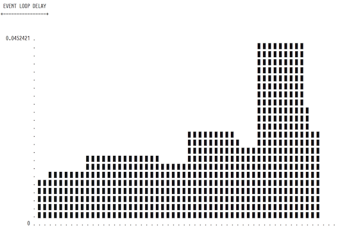

```
__.--~~.,-.__
`~-._.-(`-.__`-.
        \
         \--.
        /#   \
,--.    \    /
|  |,-.  '--' ,--.--.  ,--,--. ,-----.
|     /  |  | |  .--' ' ,-.  | `-.  /
|  \  \  |  | |  |    \ '-'  |  /  `-.
`--'`-- tap into live Node.JS apps -'
```

## Summary

`kiraz` gives a dynamic insight into your **live** *Node.JS* apps. It’s a tracing tool written in **JavaScript**, for **JavaScript**.

What `kiraz` provides is known as “**[dynamic tracing][dynamic-process-analysis]**”:

> The goal of **dynamic tracing** is to enable a rich set of debugging information in **live processes**, *often in production*, to help discover the *root cause* of an issue.

## Say What?

`kiraz` enables “*tapping*” into your **Node.JS** apps without needing to install things like [`dtrace`][dtrace] or [`ktap`][ktap].

If that rings a bell, skip to the next section. Otherwise, you might want to [read about `dtrace` first][dtrace].

And while you’re at it, you might like looking into the following tools and technologies too:

* [**Vantage** creates a **REPL** to observe your running **Node.JS** app in real time][vantage].
* [**Brendan D. Gregg** has excellent blog posts about all things related to **dynamic tracing** and **flame graphs**][brendan].

## Well, Isn’t This the Same as “*Debugging*”?

*Dynamic tracing* and *debugging* are different and **complementary** tools to help you root cause an issue.

When **debugging** a live app, you’ll have to restart your app in *debug mode*. Additionally, most of the time you’ll have to freeze your app at certain breakpoints to investigate the state and context of it. — Having to restart your app makes it **hard** (*if not impossible*) to debug production systems. Here’s why:

* Stopping at debug **breakpoints** will freeze your app, and your users will not be able to use it; so you’ll have to direct the traffic elsewhere. — This is not always possible for production instances.
* To enable debug mode, you’ll have to **restart** the app; which means you’ll lose valuable state information. Also restarting the app will reset its state, and it will be harder to recreate the exact conditions to reproduce the problem.
* Restarting the app will make your users **unhappy** if not done carefully (*i.e., you’ll need to redirect traffic to a backup instance, wait for existing connections to close — it is a **tedious** process*).

**Tracing**, on the other hand, enables you to put **probes** into your running system. You can look at those probes whenever you like. You won’t have to restart your server. Ergo, you won’t need to worry about losing valuable state information. Moreover, you won’t be annoying your users either.

> While we are on the topic of **debugging**, [you might want to look at **Joyent**’s guide on **Node.JS** debugging][joyent-debug]; or [investigate how the **Node.JS** debugger works][debugger]. — You might also want to read about [how remote debugging works in **Eclipse**][eclipse-debugging], [how to remotely debug apps using **WebStorm**][webstorm-debugging], or in [how easy it is to debug in the **Cloud9 IDE**][c9-debugging].

## Wait A Minute — Isn’t There [`jstrace`][jstrace] For That Already?

`kiraz` is the immediate successor of [`jstrace`][jstrace], and aside from a few minor changes, `kiraz`’s usage is fully compatible with `jstrace`.

`kiraz` has been built on top `jstrace` to provide **additional features**, **flexibility**, and **configurability**.

## Is `kiraz` a dtrace|strace|ktap|etc. Replacement?

Short answer: **No**.

At its very core, `kiraz` is a TCP client/server *pubsub* program that enables the user to inject and remotely execute tracing code.

Tools like [`dtrace`][dtrace], however, are **kernel-level** instrumentation programs.

`kiraz` operates at a much *higher* level. — This means it does not give you the  spectrum of probes that those kernel-level tools have. Therefore, you’ll need to add your own tracing logic your programs, which is not too much of a deal anyway (*see [the usage examples](#usage-examples) section for details*).

## Can I Use `kiraz` In Production?

**Absolutely!**

`kiraz` will have near-zero impact on the application’s performance when it’s idle, and it will have **negligible** performance impact when it’s in use. Hence, it’s safe to use it in production.

> **Note**
>
> If you use `kiraz` in production, and want to provide feedback, please [create an issue][create-issue].

## Dependencies

`kiraz` has been tested to work on **Node.JS v.5.x**. And it will probably work on other versions of **[Node.JS][nodejs]** too. You’ll need [Node.JS][nodejs] and [npm][npm] to use `kiraz`.

## Supported Operating Systems

Kiraz does not have any OS-specific dependencies; therefore it will probably work on Unix, Solaris, Mac OS, and Windows.

If you have problems running `kiraz` in your operating system, [please create an issue][create-issue].

## How to Install

`kiraz` has two components:

* A global application that you run on the **Communication Node**
* And a **Node.JS** *module** that you `import` into your app

For the former, you’ll need to…

```bash
npm install kiraz -g
```

And for the latter you’ll need to do a…

```bash
npm install kiraz --save
```

in your project folder.

These two commands will be enough to get you started **;)**.

## Usage Examples

Let’s assume you have two virtual containers on the same network. — For the sake of the example let’s say they have the following configuration:

```
bastion:
     IP: 10.0.0.10
     GW: 10.0.0.1
    SUB: 255.255.255.0

app:
    IP: 10.0.0.11
    GW: 10.0.0.1
   SUB: 255.255.255.0
```

(*i.e., two different containers that are on the same subnet*).

Add the following code to the **`app`** instance:

```javascript
// file: server.js

'use strict';

import { trace, start } from 'kiraz';

// opens a socket to the bastion.
start( { host: '10.0.0.10', port: 4322 } );

// polling interval.
const INTERVAL = 467;

setInterval( () => {
    setImmediate( () => {
        let delta = process.hrtime( start );

        trace(
            'eventloop:delay',
            { delta: ( ( delta[ 0 ] * 10e9 +
                delta[ 1 ] )  / ( 10e6 ) ) }
        );

        trace(
            'memory:usage',
            { percent: process.memoryUsage() }
        );
    } );
}, INTERVAL );
```

> Note that the above script is written in a newer version of **JavaScript**, you might need to [transpile it][transpile] to make it work on your system.

And put the following code to **bastion**:

```javascript
// file: trace-event-loop.js

'use strict';

import chart from 'darth';
import clear from 'clear';

exports.local = ( traces ) => {
    let data = [];
    let delays = [];
    let POLL_INTERVAL = 1000;

    traces.on( 'eventloop:delay', ( result ) => {
        delays.push( result.delta );

        if ( delays.length >= 10 ) {
            delays.shift();
        }

        data.push( Math.max.apply( Math, delays ) );
    } );

    setInterval( () => {
        clear();

        console.log( ' EVENT LOOP DELAY ' );
        console.log( '+----------------+' );
        console.log( chart( data ) );
    }, POLL_INTERVAL );

    console.log( 'Started listening…' );
};
```

> Note that the above script is writen in a newer version of **JavaScript**, you might need to [transpile it][transpile] to make it work on your system.

Let’s summarize what we have done:

* **app**: a Node.JS virtual container that publishes its event loop delay.
* **bastion**: An aggregation virtual container that can display those event loop delay measurements.

Now, on the **bastion** container (*10.0.0.10*), run the following:

```bash
# install `kiraz`,
# if you haven’t already done soe.
npm install kiraz -g

kiraz trace-event-loop.js
```

And on the **app** container (*10.0.0.11*), run the following:

```bash
node server.js
```

Now you should be able to see an “*event loop delay*” on the terminal of the “**bastion**” virtual container.

The output should look similar to this:



## Hey, I'm Stuck!

For any issues that you stumble upon, [feel free to open a ticket][create-issue], or [send an email][volkan].

## Versioning and Backwards Compatibility

`kiraz` follows [semantic versioning][semver] rules, and it is versioned in the "**major**.**minor**.**patch**" format.

* Any breaking backwards-incompatible change will increment the **major** version number.
* Any backwards-compatible enhancement will increment the **minor** version
number.
* And any bug fixes that don't add extra features will increment the **patch** version number.

## Wanna Help?

Contributors are more than welcome.

You can help make `kiraz` even better by:

* [Suggesting new features by opening issues][create-issue].
* [Cleaning up open issues][issues].
* [Finding bugs in the code and creating issues for that][create-issue].
* [Forking the code, making it better, and creating pull requests][git-pr].

> **Note**
>
> If you are planning to contribute to the source code, we won't bore you with a giant list of coding conventions **:)**. It's your contribution that that matters.
>
> Instead of a formal style guide, take care to maintain the existing
> coding style. Other than that, there's no formal contribution requirements.

## Contact Information

* **Project Owner**: [Volkan Özçelik](mailto:me@volkan.io)
* **Project Website**: <https://github.com/v0lkan/kiraz>

## Credits

`kiraz` is proudly built upon **[`jstrace`][jstrace]**.

Thanks a lot to **[TJ Holowaychuk][tj]**, **[Julian Gruber][julian]** and the [contributors][contributors].

## License

MIT-Licensed. — See [the license file](LICENSE.md) for details.

## Code of Conduct

We are committed to making participation in this project a harassment-free experience for everyone, regardless of the level of experience, gender, gender identity and expression, sexual orientation, disability, personal appearance, body size, race, ethnicity, age, religion, or nationality.

[See the code of conduct for details](CODE_OF_CONDUCT.md).


[brendan]: http://www.brendangregg.com/index.html "About monitoring, performance, and all the things in between"
[c9-debugging]: https://docs.c9.io/docs/running-and-debugging-code "Debugging in Cloud9 IDE"
[contributors]: https://github.com/v0lkan/kiraz/graphs/contributors "Contributions to kiraz so far"
[create-issue]: https://github.com/v0lkan/kiraz/issues/new "Create an Issue"
[debugger]: https://nodejs.org/api/debugger.html "Node.JS Debugger"
[dtrace]: http://www.oracle.com/technetwork/server-storage/solaris/dtrace-tutorial-142317.html "Dtrace Tutorial"
[dynamic-process-analysis]: http://www.wikiwand.com/en/Dynamic_program_analysis "Dynamic Process Analysis"
[eclipse-debugging]: https://github.com/nodejs/node-v0.x-archive/wiki/Using-Eclipse-as-Node-Applications-Debugger "Using Eclipse as a Node Application Debugger"
[git-pr]: https://help.github.com/articles/using-pull-requests/ "Pull Requests"
[issues]: https://github.com/v0lkan/kiraz/issues
[joyent-debug]: http://www.joyent.com/developers/node/debug "How to Debug Node.JS Applications"
[jstrace]: http://github.com/jstrace/jstrace "JSTrace"
[julian]: https://github.com/juliangruber "Juilian"
[ktap]: http://ktap.org "KTap"
[nodejs]: https://nodejs.org
[npm]: https://www.npmjs.com
[open-issues]: https://github.com/v0lkan/kiraz/issues "Issue List"
[semver]: http://semver.org
[tj]: https://twitter.com/tjholowaychuk "T.J."
[transpile]: https://babeljs.io "Babel.JS"
[vantage]: https://github.com/dthree/vantage "some node app — brand new point of view"
[volkan]: mailto:me@volkan.io "Volkan Özçelik"
[webstorm-debugging]: https://www.jetbrains.com/webstorm/help/run-debug-configuration-node-js-remote-debug.html "Remote debugging in Webstorm"
